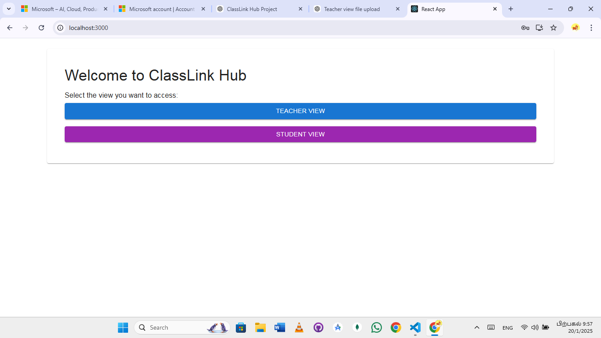
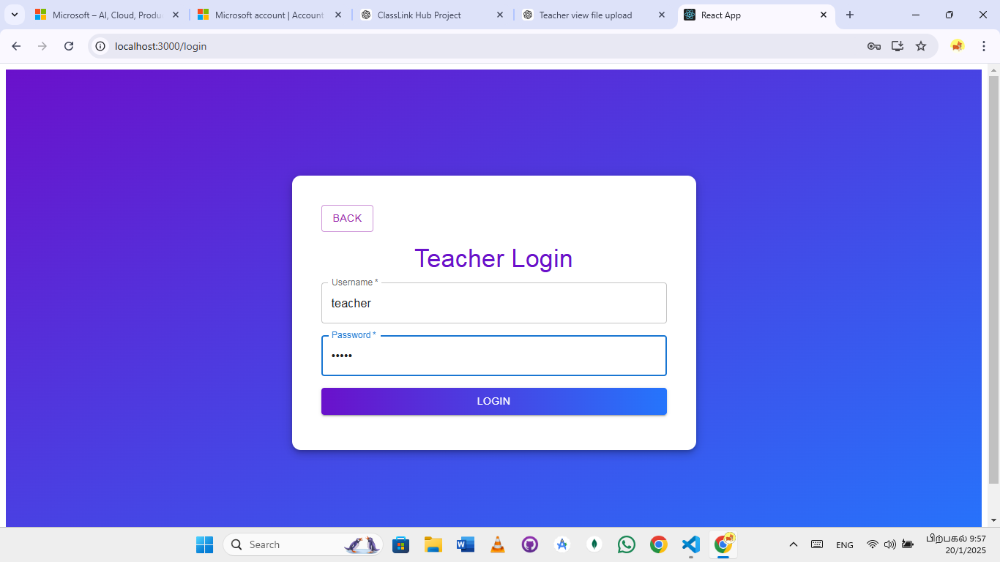
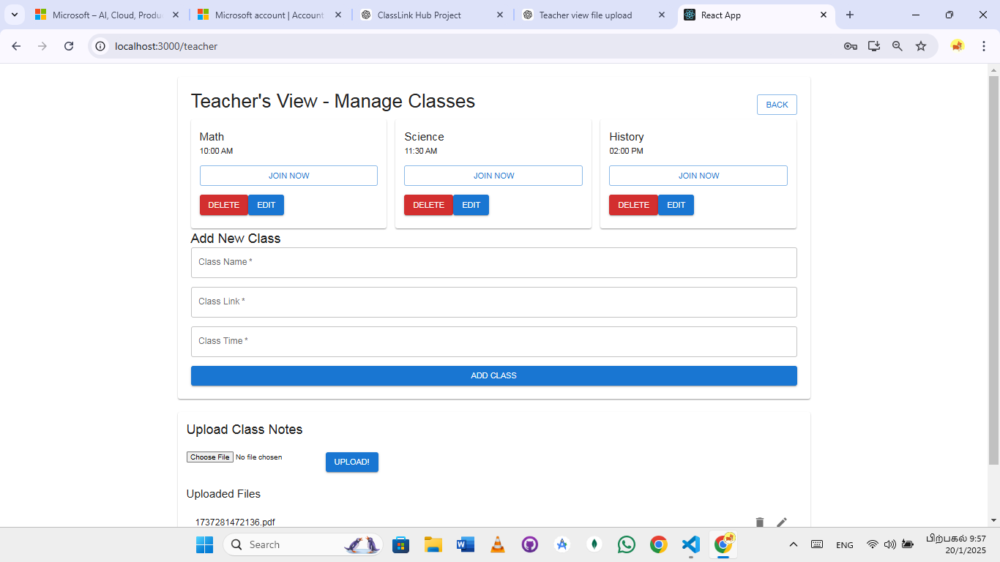
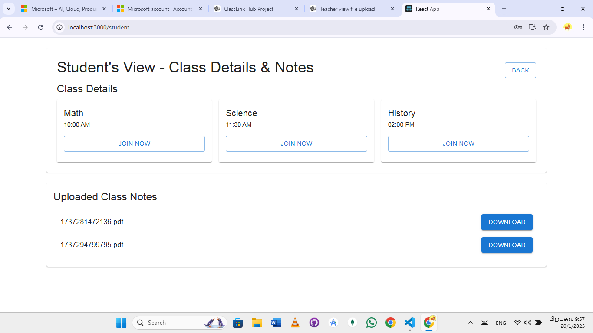

# ClassLink Hub

## Introduction  
**ClassLink Hub** is an innovative platform designed to streamline virtual learning. It integrates features such as dynamic class management, secure teacher login, real-time note sharing, and interactive dashboards, making the teaching and learning experience seamless for both teachers and students.

---

## Features  
1. **Dynamic Class Management**:  
   Teachers can add, update, and delete class details such as name, timing, and join links.

2. **Secure Teacher Login**:  
   Only authenticated teachers can access the Teacher View, ensuring privacy and security.

3. **Student Dashboard**:  
   Students can view class details, join links, and download uploaded class notes effortlessly.

4. **Real-time Note Sharing**:  
   Teachers can upload class notes in PDF format, enabling students to access them instantly.

5. **Interactive UI**:  
   A user-friendly interface with clear navigation and visually appealing elements.

---

## Technology Stack  
- **Frontend**: React.js, Material-UI  
- **Backend**: Node.js, Express.js  
- **Database**: MongoDB  
- **Hosting**: Runs locally on `http://localhost:5000`

---

## Installation & Setup  

### Prerequisites:  
- Node.js and npm installed  
- MongoDB installed and running  

### Steps to Run the Project:  
1. Clone the repository:  
   ```bash
   git clone https://github.com/dondanu/ClassLink-Hub

2. Navigate to the project directory:
   ```bash
   cd ClassLink-Hub


3. Install dependencies for both frontend and backend:
   ```bash
   npm install

4. Start the backend server:
   ```bash
   node server.js

5. Start the frontend:
   ```bash
   npm start

Access the application at http://localhost:3000.

 # Screenshots
##Home Page
Displays options to navigate to the Teacher or Student View.


##Teacher Login
Secure login for teachers to access and manage class details.


##Teacher View
Comprehensive interface for managing classes and uploading notes.


##Student View
Simplified dashboard for students to access class details and download notes.


# Future Enhancements
Add email-based login for both teachers and students.
Integrate live class notifications and reminders.
Support for additional file formats (e.g., Word, PPT).
Expand real-time collaboration features for students and teachers.
License
This project is licensed under the MIT License - see the LICENSE file for details.

# Acknowledgements
React.js for the powerful frontend development framework.
Material-UI for the beautiful and customizable UI components.
Node.js and Express.js for backend development.
MongoDB for the database.
